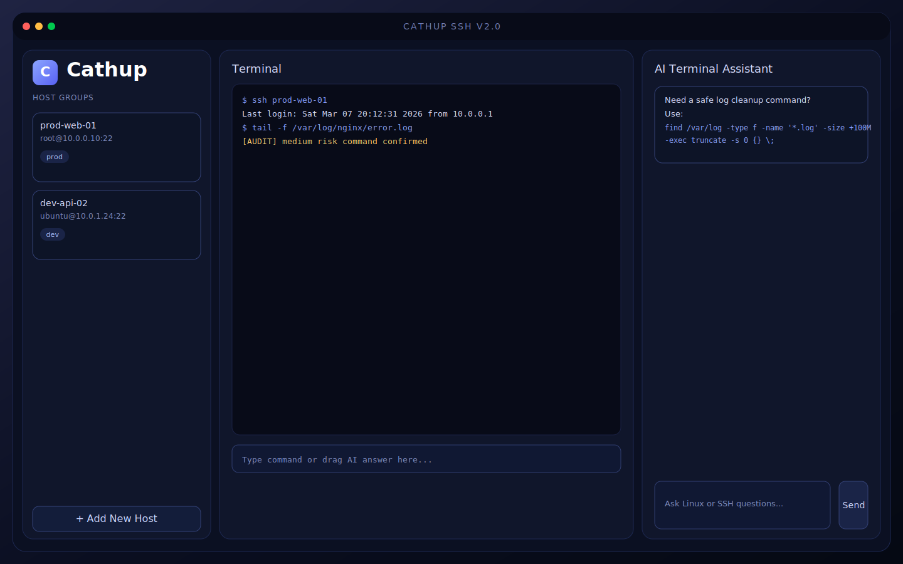

# Cathup SSH

Cathup SSH is a Smartty-style cross-platform remote operations desktop app built with `Vue 3 + Rust + Tauri`.
It provides long-lived PTY sessions, graphical SFTP operations, AI assistant integration, model presets, command auditing, and secure host credential storage via system keychain.



## Features

- Real PTY interaction with long-lived SSH session
- Command safety audit with risk levels and confirmation/deny rules
- SFTP file manager: browse, edit, upload, download
- Drag-and-drop upload to remote directory
- Right-click context menu: open/download/rename/delete
- Host grouping and tag support
- Host credentials stored in system keychain (Keychain/Credential Manager)
- AI assistant with OpenAI / Anthropic / Ollama / OpenAI-compatible APIs
- Model presets and prompt templates
- Drag AI response into terminal command input

## Tech Stack

- Frontend: Vue 3 + TypeScript + Vite
- Desktop runtime: Tauri 2
- Backend: Rust
- SSH/SFTP: `ssh2`
- AI HTTP client: `reqwest`
- Secure secret storage: `keyring`

## Project Structure

```text
smart-shell/
  src/
    App.vue
    styles.css
    composables/useBackend.ts
    types.ts
  src-tauri/
    src/main.rs
    Cargo.toml
    tauri.conf.json
  docs/
    cathup-home.svg
  .github/workflows/release.yml
```

## Prerequisites

- Node.js 20+
- Rust stable (recommended via rustup)

Windows prerequisites:

- Visual Studio Build Tools (C++ toolchain)
- WebView2 Runtime

macOS prerequisites:

- Xcode Command Line Tools

## Run in Development

```bash
npm install
npm run tauri:dev
```

## Local Packaging Steps

### 1. Build all desktop bundles

```bash
npm run tauri:build
```

### 2. Windows artifacts

- `exe`: `src-tauri/target/release/bundle/nsis/*.exe`
- `msi`: `src-tauri/target/release/bundle/msi/*.msi`

### 3. macOS artifacts

- `dmg`: `src-tauri/target/release/bundle/dmg/*.dmg`
- `app` archive: `src-tauri/target/release/bundle/macos/*.app.tar.gz`

To extract the `.app` bundle:

```bash
cd src-tauri/target/release/bundle/macos
tar -xzf *.app.tar.gz
```

After extraction you will get `Cathup SSH.app`.

## GitHub Release Packaging

Tag push triggers `.github/workflows/release.yml` and uploads release assets:

```bash
git tag v1.0.0
git push origin v1.0.0
```

Default release artifacts:

- Windows: `exe`, `msi`
- macOS: `dmg`, `app` archive
- Android: `apk`

## AI Provider Setup

Configure in the right-side AI panel:

- `provider`: `openai` / `anthropic` / `ollama` / `openai_compatible`
- `endpoint`: provider API endpoint
- `model`: model id
- `apiKey`: API key (optional for local Ollama)
- `temperature`: sampling temperature

Common endpoints:

- OpenAI: `https://api.openai.com/v1/chat/completions`
- Anthropic: `https://api.anthropic.com/v1/messages`
- Ollama: `http://127.0.0.1:11434/api/chat`

## Security Notes

- Host records are stored in system keychain instead of plain local storage.
- Commands are audited before execution.
- High-risk commands require confirmation.
- Destructive command patterns are blocked by default.

## License

MIT
